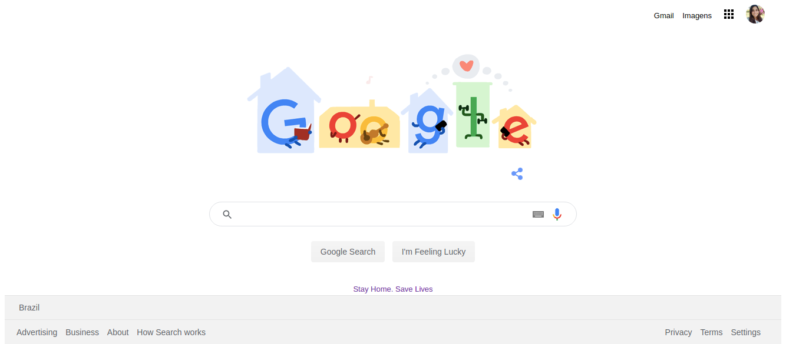

# Positioning and Floating Elements

> The task is to build a page very similar to the Google homepage. To let the project more interesting I choose to do it customized with the COVID Informations theme like the original is currently. 

The goal is to develop some skills using the dev tools from the browser,
learn and using the CSS rules to define the positions of the elements and their style.

 From The Odin Project's [curriculum](http://www.theodinproject.com/courses/web-development-101/lessons/html-css)

## Built With

- CSS and HTML

## Live Demo

[Live Demo Link](https://marilenaroque.github.io/googleProject/)

## Authors

👤 **Marilena Roque**

- Github: [MarilenaRoque](https://github.com/MarilenaRoque)
- Twitter: [@MariRoq88285995](https://twitter.com/MariRoq88285995)
- Linkedin: [roquemarilena](https://www.linkedin.com/in/roquemarilena/)

## 🤝 Contributing

Contributions, issues and feature requests are welcome!

Feel free to check the [issues page](issues/).

## Show your support

Give a ⭐️ if you like this project!

